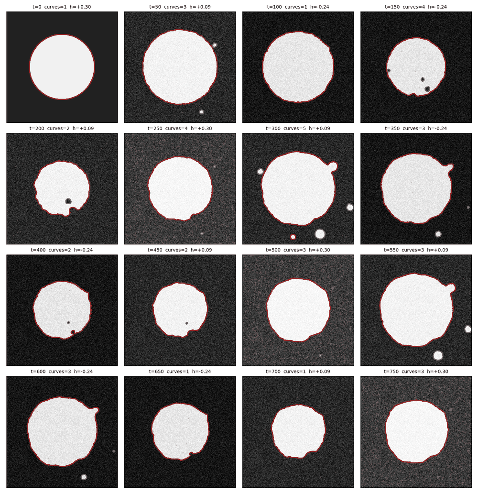
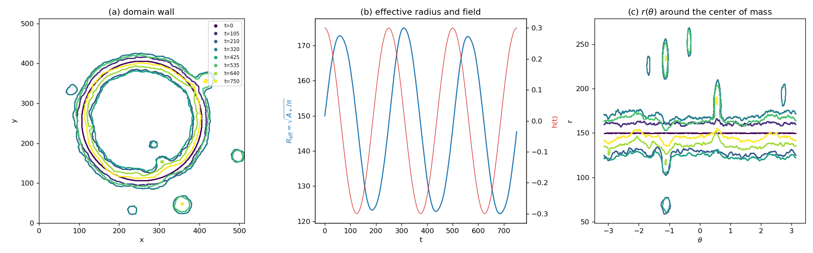
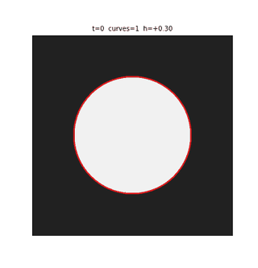
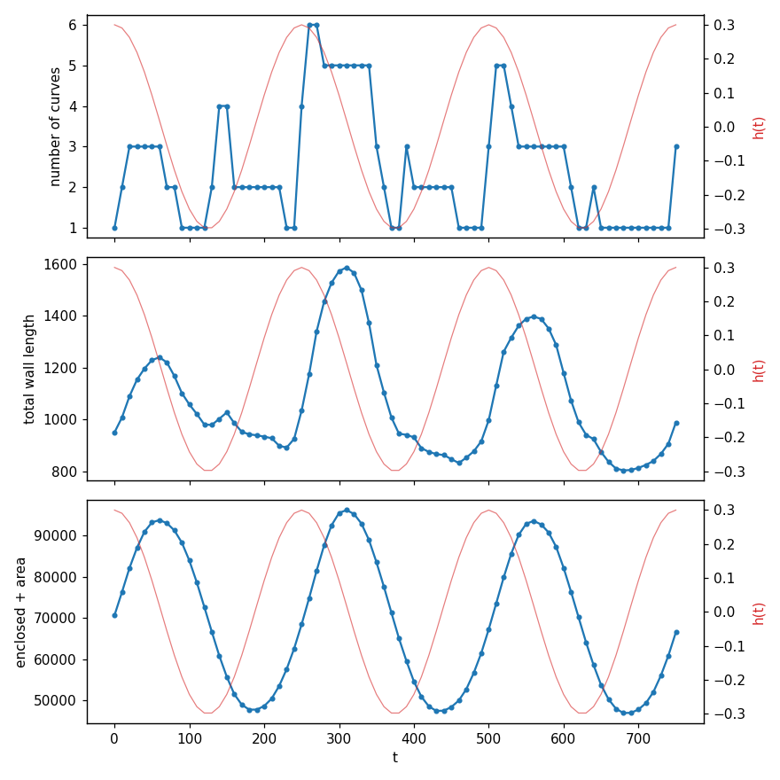

# phi4-langevin-ac

GPU (CUDA/Thrust) simulation of the **Langevin dynamics of a circular
domain** in the disordered phi^4 model. The domain is driven by an
**AC magnetic field** at finite temperature, on a lattice with periodic
boundary conditions. The code tracks the domain wall, i.e. the `phi = 0`
level set, as a function of time.



This code is associated with:

> P. Domenichini, F. N. Paris, M. G. Capeluto, M. Granada, J.-M. George,
> G. Pasquini, and A. B. Kolton, "Curvature-driven ac-assisted creep
> dynamics of magnetic domain walls," Phys. Rev. B **103**, L220409 (2021),
> [doi:10.1103/PhysRevB.103.L220409](https://doi.org/10.1103/PhysRevB.103.L220409),
> [arXiv:2012.09377](https://arxiv.org/abs/2012.09377).

That paper studies a magnetic bubble domain in an ultra-thin film. A
weak zero-bias AC field assists the curvature-driven collapse of the
bubble, which is otherwise unobservably slow because of quenched
disorder. This code simulates the same setting with a phi^4 field model:
a circular domain in a disordered medium under a zero-bias AC field, at
finite temperature. See [Citing](#citing).

## Contents

- [Quick start](#quick-start)
- [Model](#model)
- [Numerical method](#numerical-method)
- [Requirements](#requirements)
- [Build](#build)
- [Run](#run)
- [Output files](#output-files)
- [Level curves phi=0](#level-curves-phi0)
- [Post-analysis scripts](#post-analysis-scripts)
- [Demo](#demo)
- [Checks](#checks)
- [Repository layout](#repository-layout)
- [Citing](#citing)
- [License](#license)

## Quick start

```
make ARCH=sm_86                  # use your GPU's compute capability
./phi4langevin --L 512 --radius 100 --delta 0.2 --T 0.01 \
    --h0 0.3 --freq 0.002 --dt 0.05 --tmax 1500 --tout 25 --tconf 50
python3 scripts/plot_wall_evolution.py walls_seed1_nseed2.dat
python3 scripts/extract_contours.py .
python3 scripts/plot_contours.py contours_seed1_nseed2.dat --gif
```

or just `scripts/run_demo.sh` (see [Demo](#demo)).

## Model

```
d phi/dt = c * Laplacian(phi) + eps0 * [ r0 * (1 + r(x,y)) * phi - phi^3 ] + h(t) + eta(x,y,t)

h(t) = h0 * cos(2 pi f t)
<eta(x,t) eta(x',t')> = 2 T delta(x - x') delta(t - t')
```

- `L x L` square lattice, **periodic** in both `x` and `y`, with the
  5-point discrete Laplacian.
- `r(x,y)`: quenched, uncorrelated random-bond disorder, uniform in
  `[-Delta, Delta]`. It is generated once from a counter-based RNG
  (Philox, `Random123/`) keyed by site and disorder seed, so a given seed
  always gives the same disorder realization.
- `h(t)`: AC field with amplitude `h0` and frequency `f`. It is a cosine,
  so `f = 0` gives a constant (DC) field `h0`.
- `eta`: Gaussian white thermal noise at temperature `T`.
- `c`, `eps0`, `r0` are compile-time constants (`CEL`, `EPSILON0`, `R0`,
  default 1).

**Initial condition:** a disk of `phi = +1` with radius `R`, centered at
`(L/2, L/2)`, in a `phi = -1` background.

## Numerical method

The equation is integrated with the explicit **Euler–Maruyama** scheme,

```
phi_new = phi + dt * F(phi, h(t)) + sqrt(2 T dt) * xi,     xi ~ N(0,1)
```

- **Parallel update:** it is a Jacobi update with two buffers, so all
  sites update in parallel on the GPU (`eulerop` in `langevin.h`). The
  disorder is precomputed once.
- **Noise:** each site gets an independent standard Gaussian at every
  step, from Box–Muller on `Philox4x32` keyed by the noise seed. A run is
  therefore exactly reproducible given `(seed, noise-seed)`, independently
  of the GPU thread layout.
- **Field:** `h(t)` is evaluated at the beginning of each step (Itô
  convention). Time is computed as `n * dt`, not accumulated, so it does
  not drift.
- **Stability:** explicit Euler with the 5-point Laplacian is unstable for
  `dt * c >~ 0.25`. The program warns when `dt * c > 0.1`; `dt = 0.05` is
  a safe default for `c = 1`.

**Wall detection on the GPU:** the program writes a lightweight output of
the wall every `tout` time units.
1. The field is smoothed with a 5-point average (self + 4 neighbors),
   which removes spurious sign flips caused by thermal noise.
2. A wall crossing is a sign change of the smoothed field along a
   horizontal or vertical bond. Checking both directions catches every
   part of a closed contour.
3. Each crossing position is linearly interpolated along its bond.

The program also computes:
- the positive area `A+`;
- the effective radius `R_eff = sqrt(A+/pi)`;
- the center of mass of the `+` domain, as a circular mean in each
  direction so it is correct with periodic boundaries;
- the mean and variance of the distance from each wall point to that
  center of mass. The variance measures the contour roughness.

## Requirements

**Simulation (C++/CUDA)**

- An NVIDIA GPU and driver.
- The CUDA toolkit (`nvcc`), which includes Thrust. The code is
  C++14-compliant CUDA and uses only core Thrust algorithms plus the
  device intrinsics `cospif`/`sincospif`. Any reasonably recent CUDA
  (>= 10) should work, but only the version below was tested.
- A host C++ compiler supported by your `nvcc` (e.g. `gcc`).
- `make`.
- [Random123](https://www.deshawresearch.com/resources_random123.html)
  (counter-based RNG). It is vendored in `Random123/` and header-only,
  so nothing needs to be installed.

**Post-analysis (Python)** — see [`requirements.txt`](requirements.txt)

- Python >= 3.8.
- `numpy`.
- `matplotlib` (>= 3.6, which pulls in `contourpy`).
- `contourpy`, used for marching squares in `extract_contours.py`.
- `pillow`, only for `plot_contours.py --gif`.

```
python3 -m pip install -r requirements.txt
```

The demo (`scripts/run_demo.sh`) additionally needs `bash`.

**Tested environment**

| component | version |
|-----------|---------|
| OS | Ubuntu 24.04.4 LTS (kernel 6.8) |
| GPU | NVIDIA RTX A4000 Laptop GPU (compute capability 8.6) |
| NVIDIA driver | 580.173.02 |
| CUDA toolkit / `nvcc` | 12.3 (V12.3.103, from NVIDIA HPC SDK 24.1) |
| Thrust | 2.2.0 (bundled with CUDA 12.3) |
| host compiler | gcc 9.5.0 |
| Python | 3.13.11 |
| numpy / matplotlib / contourpy / pillow | 2.4.6 / 3.10.9 / 1.3.3 / 12.2.0 |

## Build

```
make                    # ./phi4langevin, default arch sm_61 (PTX runs on newer GPUs too)
make ARCH=sm_86         # compile natively for your GPU's compute capability
make CEL=2.0            # change c (or EPSILON0, R0)
make clean
```

`ARCH` is passed to `nvcc -arch`. Look up your GPU's compute capability
with `nvidia-smi --query-gpu=compute_cap --format=csv`.

## Run

```
./phi4langevin [--option value ...]      # --help lists the options
```

| option         | meaning                                       | default   |
|----------------|-----------------------------------------------|-----------|
| `--L`          | lattice size (`L x L`)                        | 256       |
| `--h0`         | AC field amplitude                            | 0         |
| `--freq`       | AC field frequency `f`                        | 0         |
| `--T`          | temperature                                   | 0         |
| `--radius`     | radius of the initial disk                    | 64        |
| `--delta`      | disorder amplitude `Delta`                    | 0.2       |
| `--dt`         | time step                                     | 0.05      |
| `--tmax`       | total simulated time                          | 100       |
| `--tout`       | time between wall outputs                     | 1         |
| `--tconf`      | time between full-field snapshots (0 = never) | 0         |
| `--seed`       | disorder seed                                 | 1         |
| `--noise-seed` | thermal-noise seed                            | seed + 1  |

To average over disorder realizations or thermal histories, loop over
`--seed` and/or `--noise-seed` in a shell script. Each run writes its
own files.

## Output files

All files are written to the working directory, with `<S>` = seed and
`<N>` = noise seed:

| file | content |
|------|---------|
| `walls_seed<S>_nseed<N>.dat` | wall crossings every `tout`. There is one gnuplot `index` block per time, headed by `# t= .. h= .. n_wall= .. A+= .. A-= .. xcm= .. ycm= ..` and followed by unordered `x y` points. |
| `timeseries_seed<S>_nseed<N>.dat` | one line per output time, with columns `t h(t) <phi> A+ R_eff n_wall xcm ycm <r> var(r)`. |
| `config_t<t>_seed<S>_nseed<N>.dat` | full `phi` field every `tconf`, as `L` rows of `L` values (row = `y`, column = `x`). Each file is ~2.4 MB for `L=512`. |
| `logfile.dat` | the run's parameters. |

For example, `plot 'walls_seed1_nseed2.dat' index 10 w d` draws the wall
at the 11th output time.

`scripts/plot_wall_evolution.py walls_seed<S>_nseed<N>.dat` plots three
panels:
- the wall at several times;
- `R_eff(t)` together with `h(t)`;
- the polar profile `r(theta)` around the center of mass.



## Level curves phi=0

For postprocessing the walls as **ordered closed curves**, run with
`--tconf > 0` and use `scripts/extract_contours.py`. It traces the
`phi = 0` level set of every snapshot:
- the field is smoothed with the same 5-point average as the GPU
  detector (`--no-smooth` traces the raw field);
- contours are traced with marching squares (`contourpy`);
- pieces cut by the periodic boundaries are stitched back together, so
  each wall is one polyline in unwrapped coordinates.

A time can have several curves, for example when the domain splits or
when droplets nucleate. A curve that wraps around the box, such as a
stripe spanning the sample, has a nonzero winding number `(wx, wy)`.

```
python3 scripts/extract_contours.py <dir> [--min-length 8] [--run seed1_nseed2]
python3 scripts/plot_contours.py <dir>/contours_seed1_nseed2.dat [--panels 16] [--gif]
```

**`contours_<run>.dat`** has one gnuplot `index` block per time. Each
block starts with `# t= .. ncurves= ..`, followed by one sub-block per
curve, longest first:

```
# curve= k npts= .. length= .. area= .. inside= +1|-1 wx= .. wy= .. xc= .. yc= ..
x0 y0
x1 y1
...
x0 y0          <- closed curves repeat the first point
```

Curves are separated by one blank line and times by two, so
`plot 'contours_seed1_nseed2.dat' index i w l` draws time `i` with
each curve as a separate line.
- `inside`: the sign of `phi` inside the curve. `+1` is a `+` domain,
  `-1` is a `-` hole or droplet.
- `area`: the enclosed area.
- `length`: the polyline length.
- `(xc, yc)`: the centroid, folded back into the box.

**`contours_<run>.csv`** has the same per-curve summary, one row per
`(t, curve)`.

`plot_contours.py` writes:
- a grid of snapshots with each curve in its own color (the figure at
  the top of this README);
- the number of curves, the total wall length and the enclosed `+` area
  vs `t`;
- with `--gif`, an animation.

## Post-analysis scripts

All scripts live in `scripts/` and are plain Python 3, except
`run_demo.sh`. Each one prints its usage with `--help`. They read the
files described in [Output files](#output-files) and get `L`, `h0` and
`f` from the `logfile.dat` in the same directory.

### `plot_wall_evolution.py` — wall, effective radius and polar profile

```
python3 scripts/plot_wall_evolution.py walls_seed<S>_nseed<N>.dat [--ntimes 8] [--L 512]
```

- **Input:** `walls_seed<S>_nseed<N>.dat` and the matching
  `timeseries_seed<S>_nseed<N>.dat`. No snapshots are needed.
- **Output:** `seed<S>_nseed<N>_evolution.png`, with three panels:
  - (a) the wall crossings at `--ntimes` evenly spaced times;
  - (b) `R_eff(t)` together with `h(t)`;
  - (c) `r(theta)`, the wall distance to the domain's center of mass, at
    the same times.
- **Options:**
  - `--ntimes`: the number of times drawn.
  - `--L`: the lattice size, if there is no `logfile.dat` next to the
    file.

### `extract_contours.py` — phi=0 level curves as ordered closed polylines

```
python3 scripts/extract_contours.py <dir> [--run seed<S>_nseed<N>] [--min-length 8] [--no-smooth]
```

- **Input:** the `config_t<t>_seed<S>_nseed<N>.dat` snapshots in `<dir>`,
  which requires a run with `--tconf > 0`.
- **Output:** `contours_<run>.dat` and `contours_<run>.csv` in `<dir>`.
  The format is described in [Level curves phi=0](#level-curves-phi0).
- **Method:**
  1. 5-point smoothing (the same as the GPU detector).
  2. `contourpy` marching squares at level 0 on the field padded
     periodically by one row and one column.
  3. Stitching of the open pieces that end on the box border, by
     matching endpoints modulo `L`. This gives curves in unwrapped
     coordinates plus their winding numbers.
  4. Per-curve statistics: length, shoelace area, centroid folded into
     the box, and `inside`, the sign of the field on the interior side
     decided by a majority vote over all segments.
- **Options:**
  - `--run`: selects a run when `<dir>` holds several.
  - `--min-length`: drops tiny loops, e.g. single-site thermal flips.
  - `--no-smooth`: traces the raw field.

### `plot_contours.py` — figures and animation of the level curves

```
python3 scripts/plot_contours.py <dir>/contours_<run>.dat [--panels 12] [--gif]
```

- **Input:** `contours_<run>.dat`. The snapshots in the same directory
  are drawn as a grey background.
- **Output:**
  - `contours_<run>_grid.png`: `--panels` times, each curve in its own
    color, with `t`, the number of curves and `h(t)` in the title.
  - `contours_<run>_ncurves.png`: the number of curves, the total wall
    length and the net enclosed `+` area (`+` domains minus `-` holes)
    vs `t`, with `h(t)`.
  - `contours_<run>.gif` (with `--gif`): all snapshots, 6 fps.

### `run_demo.sh` — end-to-end demo

```
scripts/run_demo.sh [outdir]
```

It builds the code and runs the simulation of the [Demo](#demo) into
`outdir` (default `demo/`, cleaning previous outputs there). Then it
runs the three scripts above in order.

### Typical workflow

```
./phi4langevin ... --tout 5 --tconf 10 --seed S --noise-seed N   # simulate
python3 scripts/plot_wall_evolution.py walls_seedS_nseedN.dat     # quick look (no snapshots needed)
python3 scripts/extract_contours.py . --min-length 8              # ordered closed curves -> .dat/.csv
python3 scripts/plot_contours.py contours_seedS_nseedN.dat --gif  # figures of the level curves
```

For your own analysis (curve length, area, number of pieces, `r(theta)`
spectra...), `contours_<run>.csv` is the per-curve table. The helpers
`read_contours()` in `plot_contours.py`, and `periodic_contours()` /
`curve_stats()` in `extract_contours.py`, can be imported from Python:

```python
import sys; sys.path.insert(0, "scripts")
from plot_contours import read_contours
frames = read_contours("demo/contours_seed1_nseed2.dat")   # [(t, [(header, xy), ...]), ...]
```

## Demo

```
scripts/run_demo.sh [outdir]     # default outdir: demo/ (~190 MB, ~15 s on an RTX A4000)
```

The demo runs `L=512`, `R=150`, `Delta=1`, `T=0.02`, `h0=0.3`, `f=0.004`
(period 250) for three periods:
- walls every `t=5`;
- snapshots every `t=10`.

Then it extracts the level curves and produces all the plots.




What the demo shows:
- The `+` area oscillates steadily between ~47 000 and ~96 000 and lags
  behind the field.
- The wall roughens as it moves through the disorder.
- The disorder is strong: at `Delta = 1`, some sites have
  `1 + r ~ 0`. Small `+` droplets nucleate outside the domain when
  `h > 0`, and `-` holes nucleate inside it when `h < 0`. That is why the
  level set has up to ~6 curves per snapshot; `inside` distinguishes the
  two kinds.

Most of these extra curves are nucleation events, not pinch-off of the
main domain. To study splitting of the main domain, use weaker disorder
(e.g. `Delta ~ 0.5–0.8`) or lower `T` to suppress nucleation.

## Checks

- **Curvature-driven shrinking** (`--delta 0 --T 0 --h0 0`): Allen–Cahn
  predicts `R^2(t) = R^2(0) - 2 c t`.
  - With `c = 1`, `L = 256`, `R = 80`, the fitted slope is `-1.88 c`. The
    wall is only ~1.4 lattice spacings wide, so the lattice
    discretization reduces the slope.
  - With `c = 4` (a wider wall), the slope is `-1.975 c`.
- **DC field** (`--freq 0 --h0 0.1 --delta 0 --T 0`): the radius grows at
  a constant speed of ~0.197. The sharp-interface prediction is
  `v = 2 h / sigma - c/R`, with wall tension `sigma = 2 sqrt(2)/3`,
  which gives ~0.20.
- **Reproducibility:** repeated runs with the same seeds give
  byte-identical output. Changing `--noise-seed` changes it.
- **Contour stitching:** on synthetic periodic fields, `extract_contours.py`
  gives:
  - one closed curve for a disk that crosses the box corner;
  - `inside = -1` for a hole inside a domain;
  - winding `(±1, 0)` for a stripe that wraps around the box.

## Repository layout

```
main.cu                        option parsing, time loop, output
langevin.h                     System class: Euler-Maruyama kernel, disorder, noise, wall detection
Makefile
scripts/run_demo.sh            demo run + analysis
scripts/plot_wall_evolution.py walls / R_eff(t) / r(theta) from walls_*.dat
scripts/extract_contours.py    phi=0 level curves (ordered, periodic-stitched) from snapshots
scripts/plot_contours.py       grid / time series / GIF of the level curves
docs/                          figures used in this README
Random123/                     vendored counter-based RNG (D. E. Shaw Research)
```

## Citing

If you use this code, please cite the associated paper. The preprint is
[arXiv:2012.09377](https://arxiv.org/abs/2012.09377). arXiv's journal-ref
lists the article as "220409", but the published article number is
**L220409**, because it appeared as a Letter. GitHub's "Cite this
repository" button uses [`CITATION.cff`](CITATION.cff).

```bibtex
@article{PhysRevB.103.L220409,
  title         = {Curvature-driven ac-assisted creep dynamics of magnetic domain walls},
  author        = {Domenichini, P. and Paris, F. N. and Capeluto, M. G. and Granada, M.
                   and George, J.-M. and Pasquini, G. and Kolton, A. B.},
  journal       = {Phys. Rev. B},
  volume        = {103},
  issue         = {22},
  pages         = {L220409},
  numpages      = {5},
  year          = {2021},
  month         = {Jun},
  publisher     = {American Physical Society},
  doi           = {10.1103/PhysRevB.103.L220409},
  url           = {https://doi.org/10.1103/PhysRevB.103.L220409},
  eprint        = {2012.09377},
  archivePrefix = {arXiv},
  primaryClass  = {cond-mat.dis-nn}
}
```

## License

MIT — see [LICENSE](LICENSE) — for the code in this repository.

`Random123/` is a vendored, header-only copy of the
[Random123](https://www.deshawresearch.com/resources_random123.html)
counter-based RNG library by D. E. Shaw Research, BSD-3-Clause licensed
(license text in each file's header).
